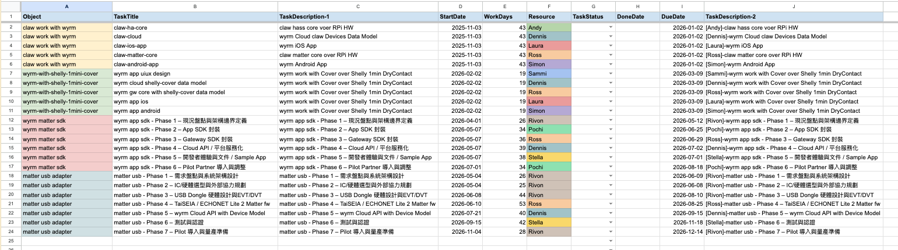
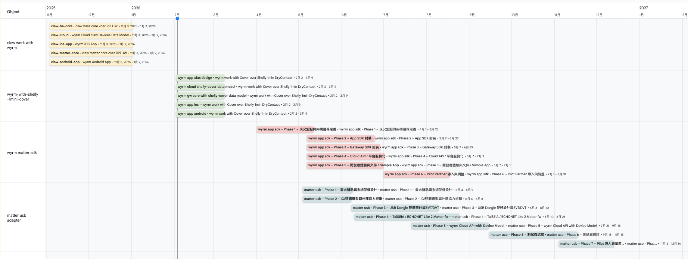
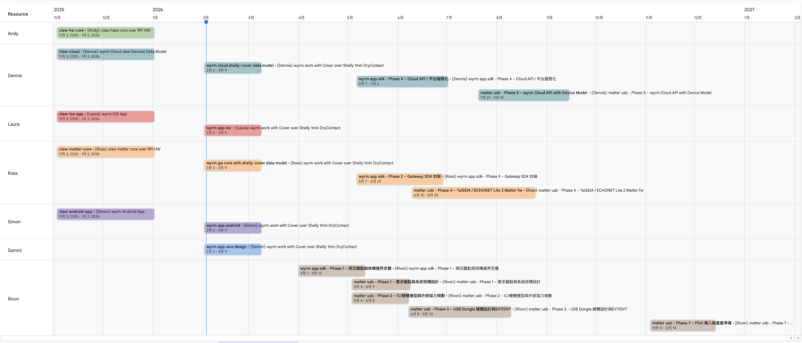

# gasWbsTimelineViewAgent - WBS 自動化工具

這是一個 Google Apps Script 專案，旨在自動化 Google Sheets 中的工作分解結構 (WBS) 管理，簡化專案規劃與任務追蹤。

## 功能特色

*   **一鍵建立 WBS 工作表**: 自動生成包含預設欄位、公式、格式與資料驗證的 `wbs` 與 `holidays-tw` 工作表。
*   **智慧欄位自動化**:
    *   **截止日期 (`DueDate`)**: 根據 `StartDate` 和 `WorkDays` 自動計算，並會排除 `holidays-tw` 中定義的假日。
    *   **任務描述 (`TaskDescription-2`)**: 根據 `TaskDescription-1` 和 `Resource` 自動合併生成，方便追蹤。
    *   **完成日期 (`DoneDate`)**: 當 `TaskStatus` 設為 `Done` 時，自動填入當天日期；若更改為其他狀態，則會自動清除。
*   **自動儲存格顏色標記**:
    *   當 `Object` (A欄) 或 `Resource` (F欄) 的內容變更時，腳本會**自動為該儲存格**套用獨特的背景顏色，方便使用者視覺化分組與辨識。
    *   此功能在背景自動執行，不會跳出任何提示訊息。

## 視覺化時間軸 (甘特圖)

WBS 的本質是 Project 的 work breakdown 的分析。

WBS 的核心價值在於將專案任務進行系統性的分解。搭配 Google Sheets 內建的 **時間軸** 功能，你可以將 WBS 的內容轉換為視覺化的甘特圖，從不同維度進行專案管理與資源分配。

### 專案甘特圖 (Project Gantt View)
你可以利用 `Object` 欄位來追蹤不同目標（例如：不同專案、不同產品線）之間的時程重疊情況，確保開發步調一致。

### 資源檢視圖 (Resource View)
你可以利用 `Resource` 欄位來追蹤同一個資源（例如：同一個團隊成員）在同一時間是否被指派了過多的任務，避免不合理的工作分配。

---

## 安裝與使用說明

1.  **開啟 Google Sheet**: 建立或開啟一個 Google Sheet 檔案。
2.  **進入 Apps Script 編輯器**: 點擊頂部選單的 **擴充功能 > Apps Script**。
3.  **貼上程式碼**: 將本專案中的 `code.js` 檔案內容完整複製並貼到 Apps Script 編輯器中。
4.  **儲存專案**: 點擊儲存按鈕。
5.  **重新整理 Google Sheet**: 回到 Google Sheet 頁面並重新整理瀏覽器。你會在頂部選單看到一個新的 **"🚀 WBS 自動化工具"** 選單。

---

## 選單功能詳解

### 1. 建立新 WBS 工作表
*   **功能**: 初始化整個 WBS 環境，建立 `wbs` 和 `holidays-tw` 兩個工作表。
*   **操作**: 點擊 **🚀 WBS 自動化工具 > 1. 建立新 WBS 工作表**。

### 2. 重設任務內容與公式 (保留首欄)
*   **功能**: 清除 `wbs` 工作表中除了第一列（標頭）和第一欄（Object）以外的所有任務內容，並重新套用所有自動化公式。適用於重複使用 WBS 範本或修復損壞的公式。
*   **操作**: 點擊 **🚀 WBS 自動化工具 > 2. 重設任務內容與公式 (保留首欄)**。

### 3. 套用 Object 顏色標記
*   **功能**: 手動觸發，為 `Object` 欄（A欄）中所有擁有相同值的儲存格套用相同的背景顏色。
*   **操作**: 點擊 **🚀 WBS 自動化工具 > 3. 套用 Object 顏色標記**。

### 4. 套用 Resource 顏色標記
*   **功能**: 手動觸發，為 `Resource` 欄（F欄）中所有擁有相同值的儲存格套用相同的背景顏色。
*   **操作**: 點擊 **🚀 WBS 自動化工具 > 4. 套用 Resource 顏色標記**。

---

## 手動測試說明

你可以依據以下步驟，驗證所有功能是否正常運作。

### 測試 1: 初始化設定
1.  點擊選單 **"1. 建立新 WBS 工作表"**。
2.  **驗證**:
    *   應成功建立 `wbs` 和 `holidays-tw` 工作表。
    *   `wbs` 工作表的標頭應為藍底粗體。
    *   `G` 欄 (`TaskStatus`) 應有下拉選單。
    *   `I2` (`DueDate`) 和 `J2` (`TaskDescription-2`) 儲存格應包含正確的公式。

### 測試 2: `DueDate` 自動計算
1.  在 `holidays-tw` 的 `A2` 填入一個日期 (例如 `2026-02-03`)。
2.  在 `wbs` 的 `D2` (`StartDate`) 填入 `2026-02-01`，`E2` (`WorkDays`) 填入 `5`。
3.  **驗證**: `I2` (`DueDate`) 應自動計算出 `2026-02-09`。

### 測試 3: `TaskDescription-2` 自動生成
1.  在 `C2` (`TaskDescription-1`) 輸入 `開發新功能`。
2.  **驗證**: `J2` 應顯示 `[未指派]-開發新功能`。
3.  在 `F2` (`Resource`) 輸入 `工程師A`。
4.  **驗證**: `J2` 應自動更新為 `[工程師A]-開發新功能`。

### 測試 4: `DoneDate` 自動更新
1.  在 `G3` (`TaskStatus`) 的下拉選單中選擇 `Done`。
2.  **驗證**: `H3` (`DoneDate`) 應自動填入今天的日期。
3.  將 `G3` 的狀態改為 `InProgress`。
4.  **驗證**: `H3` 的日期應被自動清除。

### 測試 5: `Object` 儲存格顏色標記
1.  在 `A2` 和 `A3` 輸入 `專案A`，在 `A4` 輸入 `專案B`。
2.  **驗證 (自動觸發)**:
    *   `A2` 和 `A3` 儲存格應自動變為相同的背景顏色。
    *   `A4` 儲存格應有不同的背景顏色。
    *   **確認只有 A 欄的儲存格有顏色，B、C、D 等欄位不受影響**。
3.  你也可以透過選單 **"3. 套用 Object 顏色標記"** 來手動觸發一次性的全域套用。

### 測試 6: `Resource` 儲存格顏色標記
1.  在 `F2` 和 `F4` 輸入 `工程師A`，在 `F3` 輸入 `工程師B`。
2.  **驗證 (自動觸發)**:
    *   `F2` 和 `F4` 儲存格應自動變為相同的背景顏色。
    *   `F3` 儲存格應有不同的背景顏色。
    *   **確認只有 F 欄的儲存格有顏色，其他欄位不受影響**。
3.  你也可以透過選單 **"4. 套用 Resource 顏色標記"** 來手動觸發。