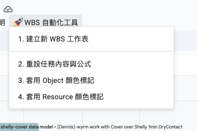

基於 [text](gas-spec-v1.0.1.md) 規格設計，
補上 google sheets 客製化 menu 功能說明與截圖  
WBS 的本質是 Project 的 work breakdown 的分析 ，
使用者可以透過 WBS 內容與 Google Sheets 「時間軸」功能，
設計成 WBS 的 Object 欄位設計成 Project Gantt View  ，
同時依據 WBS 的 Resource 欄位（填上工作人員的名字）設計成組織的 Resource View ，
project Gantt View 用來追蹤同一時間不同目標 object 之間是否有重疊時間，
resource view 用來追蹤同一個 resource 是否有同時安排大量目標任務執行這樣不合理的工作分配，
依照以上訊息，更新 [text](README.md) 並且同時附上圖檔，增加易讀性
